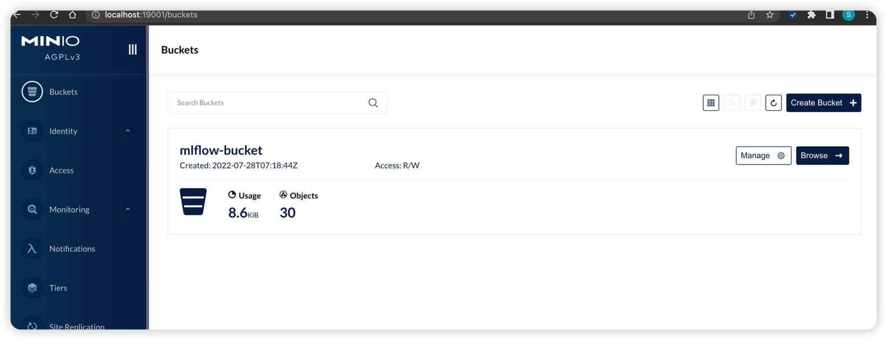
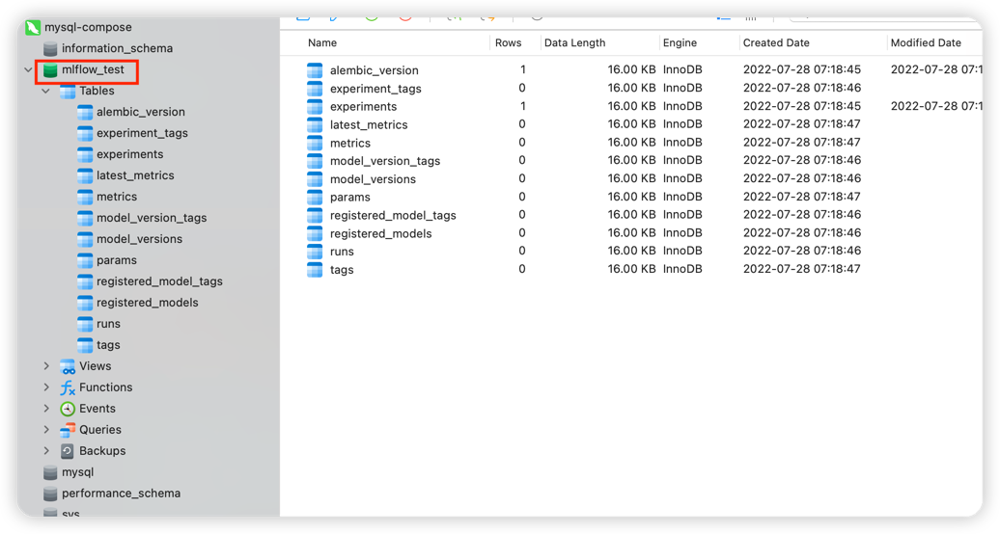
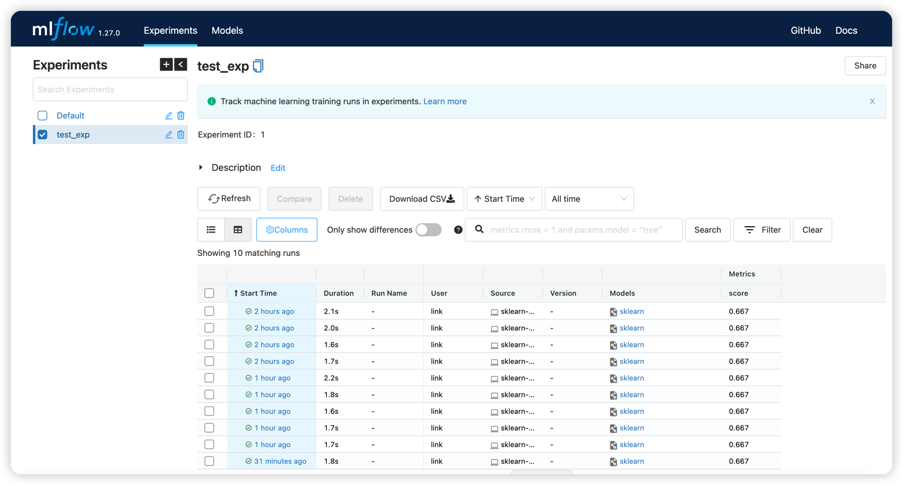

## 构建机器学习平台

​	使用MLflow构建机器学习平台，一键拉起平台，使用`msyql`作为后端，`minio` oss作为artifact store.

- backend-store: `mysql`
- artifact-store:`minio` 

​	所需依赖:

- 启动mlflow tracking server
  - Docker compose

- 使用mlflow tracking server
  - requirements.txt

### 1、使用姿势

#### 	1.1、启动mlflow tracking服务

```shell
# 拉取代码
git clone .
# docker compose 
docker-compose up --build --force-recreate
```

​	服务在启动过程中,会首先启动mysql+minio容器,

- mysql,并在之后创建mlflow_test数据库.本地映射端口号:3306--->>>33061
- minio,并在之后创建mlflow_bucket.本地映射端口号:address,9000--->>>:19000;console-address,9001:19001

​	之后启动mlflow tracking server容器

- 创建mlflow_test&mlflow_bucket
- mlflow server启动，并映射本地端口号:5002--->>>15002

​	如下图所示：
- [minio console](http://localhost:19001)

- mlflow_test 数据库


- [mlflow tracking server](http://localhost:15002)

#### 1.2、上传&拉取模型

- 安装依赖

```shell
pip install requirements.txt
```

- examples文件夹下一些使用示例:

```shell
python examples/*.py
```

## 3、配置

### 3.1、文件说明

- `build-mlflow` ，构建mlflow镜像
- `examples` ,training--->>>tracking server/tracking server --->>>inference的示例代码
- `requirements.txte`,examples下的示例代码所需的依赖
- `docker-compose.yml` ，构建配置

### 3.2、测试版本

- macOS Monterey
- Docker version 20.10.17, build 100c701
- docker-compose version 1.29.2, build 5becea4c

### 参考

- [Mlflow tracking server官方**使用姿势**(官方)](https://www.mlflow.org/docs/latest/tracking.html)

